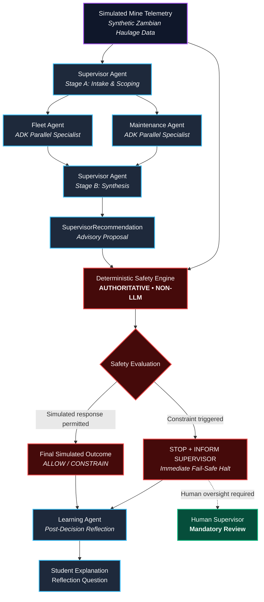

# Agent Architecture Diagram — OrePulse AI

**System Classification**: EDUCATIONAL SIMULATION • SYNTHETIC DATA  
**Agent Runtime**: Google ADK 2.0 (`google-adk==1.18.0`)  
**Safety Engine**: AUTHORITATIVE • DETERMINISTIC • NON-LLM  

---

## 1. End-to-End Workflow & Governance Graph

---

## 2. Component Authority & Responsibility Matrix

| Component | Authority | Responsibility | Runtime Layer |
| :--- | :--- | :--- | :--- |
| **Fleet Agent** | Advisory | Analyze simulated fleet availability, haul road flow, and ramp congestion. | Python / Google ADK 2.0 |
| **Maintenance Agent** | Advisory | Detect simulated thermal anomalies and evaluate mechanical stress severity. | Python / Google ADK 2.0 |
| **Supervisor Agent** | Advisory | Stage A: Intake & Scoping. Stage B: Multi-signal synthesis into a structured proposal. | Python / Google ADK 2.0 |
| **Safety Engine** | **Authoritative** | Apply deterministic simulated safety constraints; overrule AI proposals when safety bounds breach. | TypeScript (`apps/server/src/safety.ts`) |
| **Learning Agent** | Pedagogical | Explain the final simulated outcome post-decision and encourage student reflection. | Python / Google ADK 2.0 |
| **Human Supervisor** | **Human Oversight** | Review escalated simulated situations requiring human operational intervention. | Human in the Loop |

---

## 3. Core Architectural Principle

> **Observe → Analyze → Collaborate → Propose → Govern → Explain → Reflect.**
> 
> *The AI agents provide analysis and proposals.*  
> *The deterministic Safety Engine governs the simulated outcome.*  
> *Human oversight remains essential.*  
> *The learner remains the person making sense of the experiment.*
