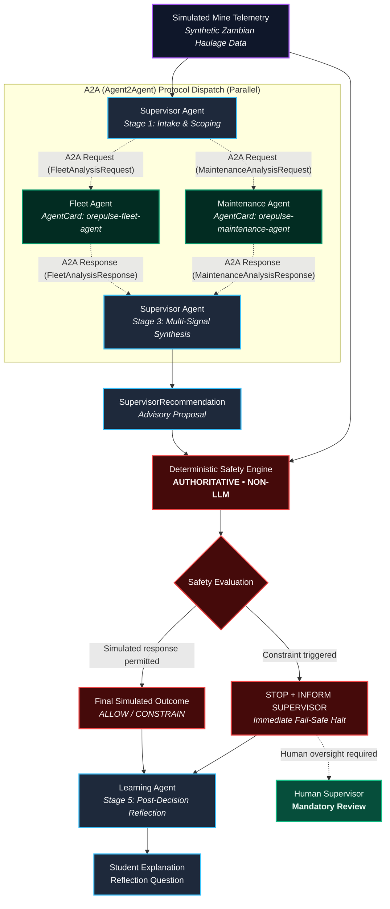

# OrePulse AI — Architectural Specification

**System Classification**: EDUCATIONAL SIMULATION • SYNTHETIC DATA  
**Primary Agent Runtime**: Google ADK 2.0 (`google-adk==1.18.0`)  
**Authoritative Safety Layer**: Deterministic TypeScript Safety Engine (`apps/server/src/safety.ts`)  
**Development Environment**: Google Antigravity IDE  
**Development Tooling**: Google Agents CLI (`google-agents-cli==1.0.0`) & Installed Skills  

---

## 1. Executive Summary & Core Principle

OrePulse AI is an interactive educational mining simulation laboratory. It allows students and learners to observe, experiment with, and understand multi-agent AI collaboration under strict industrial safety constraints.

> **OrePulse is an educational mining simulation using synthetic data. It does not control real mining equipment, authorize real mining operations, or provide real-world operational instructions.**

### Core Architectural Principle:
> **AI proposes. Deterministic safety constraints govern the simulated response. Human oversight remains essential.**

```text
Observe → Analyze → Collaborate → Propose → Govern → Explain → Reflect
```

---

## 2. Component Authority & Responsibility Matrix

| Component | Authority | Responsibility | Runtime Layer |
| :--- | :--- | :--- | :--- |
| **Fleet Agent** | Advisory | Analyze simulated fleet availability, haul road bottlenecks, and ramp congestion. | Python / Google ADK 2.0 |
| **Maintenance Agent** | Advisory | Detect simulated thermal anomalies and evaluate equipment mechanical stress severity. | Python / Google ADK 2.0 |
| **Supervisor Agent** | Advisory | Stage A: Intake & Scoping. Stage B: Multi-signal synthesis into an advisory proposal (`SupervisorRecommendation`). | Python / Google ADK 2.0 |
| **Safety Engine** | **Authoritative** | Apply deterministic simulated safety constraints; overrule AI proposals when safety bounds breach. | TypeScript (`apps/server/src/safety.ts`) |
| **Learning Agent** | Pedagogical | Explain the final simulated outcome post-decision and generate Socratic reflection questions. | Python / Google ADK 2.0 |
| **Human Supervisor** | **Human Oversight** | Review escalated simulated situations requiring human operational intervention. | Human in the Loop |

---

## 3. Two-Runtime Dual Architecture

OrePulse is cleanly partitioned into two cooperating runtimes communicating strictly via validated JSON contracts:

### A. TypeScript Runtime (Frontend + Simulation Server)
- **Frontend (`apps/web/`)**: React + Vite educational dashboard with What-If experimentation controls, real-time trace inspection, and pedagogical reflection cards.
- **Fastify Server (`apps/server/`)**: Exposes REST endpoints (`/api/simulation/run`, `/api/lab/run`, `/api/scenario/list`).
- **Mathematical Simulation Engine (`apps/server/src/simulation.ts`)**: Pure deterministic state machine generating synthetic telemetry (haul truck temperatures, haul ramp congestion levels, fleet availability).
- **Authoritative Deterministic Safety Engine (`apps/server/src/safety.ts`)**:
  - Independent non-LLM safety guardrail.
  - Vets every AI proposal against physical and operational safety boundaries.
  - Automatically mandates `STOP_AND_INFORM_SUPERVISOR` with mandatory human oversight whenever critical thermal (>100°C) or compounding risk (>60% congestion + overheat) conditions occur.
  - Cannot be bypassed or overridden by AI agents.

### B. Python Runtime (Google ADK 2.0 + A2A Protocol Layer)
- **Framework**: Built on **Google ADK 2.0** (`google-adk==2.9.1`) and the **A2A (Agent2Agent) Protocol** (`a2a-sdk==1.1.2`, `json-rpc==1.15.0`).
- **Composition & A2A Communication**:
  - `SupervisorAgent` (`agent-runtime/agents/supervisor.py`): Performs intake & scoping, issues A2A requests with correlation IDs, and synthesizes specialist findings.
  - `FleetAgent` (`agent-runtime/agents/fleet.py`): Autonomous specialist implementing `handle_a2a_request` via `FleetAgentCard` and `analyzeFleetTelemetry` method.
  - `MaintenanceAgent` (`agent-runtime/agents/maintenance.py`): Autonomous specialist implementing `handle_a2a_request` via `MaintenanceAgentCard` and `analyzeEquipmentHealth` method.
  - `A2ATransport` (`agent-runtime/a2a_protocol/transport.py`): Asynchronous JSON-RPC 2.0 protocol dispatcher coordinating parallel specialist requests with timeouts, correlation IDs, schema validation, and fallback hooks.
  - `LearningAgent` (`agent-runtime/agents/learning.py`): Executes strictly **after** final Safety Engine determination to produce plain-language student explanations.
- **Execution Mode & Fallback**:
  - Distinguishes `executionMode: "a2a_adk"` from `executionMode: "deterministic_fallback"`.
  - If agent or network services are unavailable, the runtime falls back deterministically while preserving full safety guarantees.

---

## 4. End-to-End Workflow & A2A Execution Trace



---

## 5. Tooling Separation

- **Antigravity**: Development environment and IDE.
- **Agents CLI & Skills (`google-agents-cli`)**: Development and testing tooling.
- **Google ADK 2.0 (`google-adk`)**: Application runtime framework.
- **A2A Protocol (`a2a-sdk`)**: Agent-to-Agent interoperable communication protocol.
- **TypeScript Safety Engine**: Authoritative deterministic governance.

